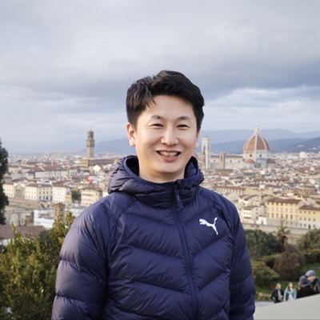
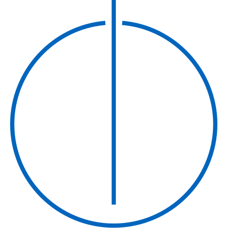

# **Wei GENG**

<!-- Recent News block — content lives in includes/news.md (edit there to add items) -->
--8<-- "news.md"

## 📄 Short Bio

<!-- Photo floats into the bio (text wraps around it); the contact links
     live in includes/profile.md, included just below the bio. -->

I am a doctoral researcher & Ph.D. candidate supervised by [Prof. Dr.-Ing. Jörg Ott](https://www.ce.cit.tum.de/cm/research-group/joerg-ott/) at [Chair of Connected Mobility, TUM](https://www.ce.cit.tum.de/cm/home/). I am also a member of [SPEAR Lab, TU Delft](https://spearlab.nl/people) led by [Prof. Nitinder Mohan](https://www.nitindermohan.com/), mentored by [Prof. Dirk Kutscher](https://dirk-kutscher.info/about/) at [HKUST(GZ)](https://www.hkust-gz.edu.cn/). My current research interests lie in **Accelerating Networked Systems by Edge Computing**, such as visual perception pipelines.

I obtained my M.Phil. degree from [HKUST(GZ)](https://www.hkust-gz.edu.cn/), where I was luckily advised by Prof. [Pan Hui](https://panhui.people.ust.hk/index.html), Prof. [Gareth Tyson](http://www.eecs.qmul.ac.uk/~tysong/), and Prof. [Dirk Kutscher](https://dirk-kutscher.info). Previously, I was a full-time research engineer focusing 5G core network performance optimization at [Huawei](https://www.huawei.com) and lucky to work with Mr. Jing Liu, Dr. Wei Wang, and Dr. Sui Zhou. I obtained my M.Eng and B.Eng from [Fudan University](https://www.fudan.edu.cn/en/) and [Harbin Engineering University](https://english.hrbeu.edu.cn) respectively. I interned at [Alipay](https://www.antgroup.com) and [eBay](https://www.ebay.com).

<!-- Contact links (email + social icons), shown in a row below the bio -->
--8<-- "profile.md"

## 💻 Research Interests & Pubs

Edge Computing and Networked Systems

  - Efficiency, Scalability, Cost Optimization of Edge Systems [[IFIP Net'26-SMOOTH]](papers/smooth.md) [[BeyondAcc Under Review]]
  - Networking for Edge Computing [[CoNext'25-Poster-KUT]](papers/kut.md) [[ICN'23-SoK]](papers/sok.md)
  - Selective Task offloading in edge-cloud continuum. [[SIGCOMM-NAIC'26-Bgt-ada]](papers/bgt-ada.md) [WIP-ASIDE]
  - Sustainability (Energy Efficiency) of Edge Systems [[Horizon Europe Project - CIRES]](https://ec.europa.eu/info/funding-tenders/opportunities/portal/screen/programmes/horizon)
  - Golang runtime scheduler & OS kernel optimization

## 🔬 Research Projects

- Horizon Europe Project - [Resilient Edge Systems for Critical infrastructure and Urban Environments](https://cordis.europa.eu/project/id/101225910)

## 🎤 Talks & Presentations

- **[Budget-Adaptive Routing](papers/bgt-ada.md)** — NAIC @ ACM SIGCOMM 2026, Denver, CO, USA *(upcoming)*
- **[SMOOTH](papers/smooth.md)** — IFIP Networking 2026, Lugano, Switzerland
- **[TU Munich & Delft Joint Seminar](https://www.ce.cit.tum.de/cm/events/doctoral-seminar/ds-2025-10-1/)** — Delft, Netherlands
- **[KUT](papers/kut.md)** (poster) — ACM CoNEXT 2025, Hong Kong SAR
- **[SoK: Distributed Computing in ICN](papers/sok.md)** — ACM ICN 2023, Reykjavík, Iceland

## 🧑‍🏫 Teaching & Supervision

I teach and supervise at the [Chair of Connected Mobility, TUM](https://www.ce.cit.tum.de/cm/home/). Full details on the [Teaching & Supervision](teaching/index.md) page.

- **Courses** @TUM — [Networked AI Systems](teaching/index.md#networked-ai-systems) (seminar) · [Edge Computing & IoT](teaching/index.md#edge-computing--iot) (practical) · [Hot Topics in Edge Computing](teaching/index.md#hot-topics-in-edge-computing) (seminar)
- **Supervision** — [ongoing students & completed theses](teaching/index.md#supervision), plus [open topics](https://www.ce.cit.tum.de/cm/thesis-guided-research/open-thesis-topics-guided-research/)
- **Prospective students** — I supervise BSc/MSc theses, guided research & internships. Feel free to [email me](mailto:wei.geng@tum.de).
- **Certification** — Certificate in Higher Education Teaching, Bavaria (Advanced Level) — ProLehre | Media and Didactics, 2024

## 🤝 Academic Service

### Program Committees & Reviewing

- **EuroSys 2026** — Artifact Evaluation Committee · Shadow TPC
- **ACM IMC 2025** — Shadow TPC
- **ACM ICN 2023** — Program Committee (Poster & Demo Track)
- **IEEE VRW 2023** — Program Committee

### Professional Membership

- Student Member, **IEEE** and **ACM**

## 💼 Working Experience

- {.inline-logo} Huawei Technologies - 5G and High Performance Computing, Shanghai, 2020~2022.
- {.inline-logo} Ant Group - Intern in Cloud Computing, Hangzhou, Summer, 2019
- {.inline-logo} eBay - Intern in Big Data and Distributed Systems, Shanghai, Winter, 2018

## 🎓 Education

- Ph.D. Student - {.inline-logo}[CIT](https://www.cit.tum.de/cit/startseite/), {.inline-logo} Technical University of Munich, Munich, Germany - 2024.10~
- Lab Member {.inline-logo .logo-invert} [SPEAR Lab](https://spearlab.nl/people), {.inline-logo .logo-invert} TU Delft, Delft, Netherlands - 2024.10~
- M.Phil. - {.inline-logo} The Hong Kong University of Science and Technology, Guangzhou, China - 2022.9~2024.10
- M.Eng. - {.inline-logo} Fudan University, Shanghai, China - 2017~2020
- B.Eng. - {.inline-logo} Harbin Engineering University, Harbin, China - 2013~2017
- Visiting Student - {.inline-logo} Politecnico di Milano, Milan, Italy - 2023.3

<!-- ## **Publications** -->

<!--  -->

<!--  -->

## 🏸 Hobbies

- Sports: Basketball, Badminton, Ping-pong, Gym.
- Open Source
    - A set of extensions I wrote for Raycast can be found [here](https://www.raycast.com/ViGeng?via=ViGeng)
- Pen Calligraphy
